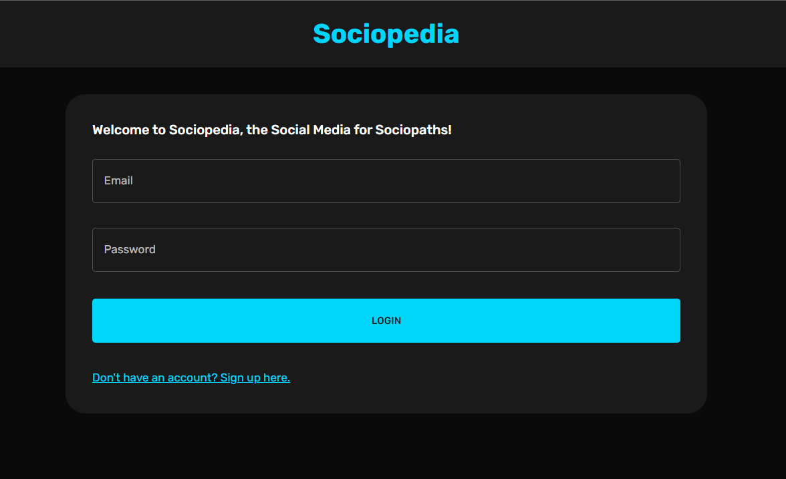
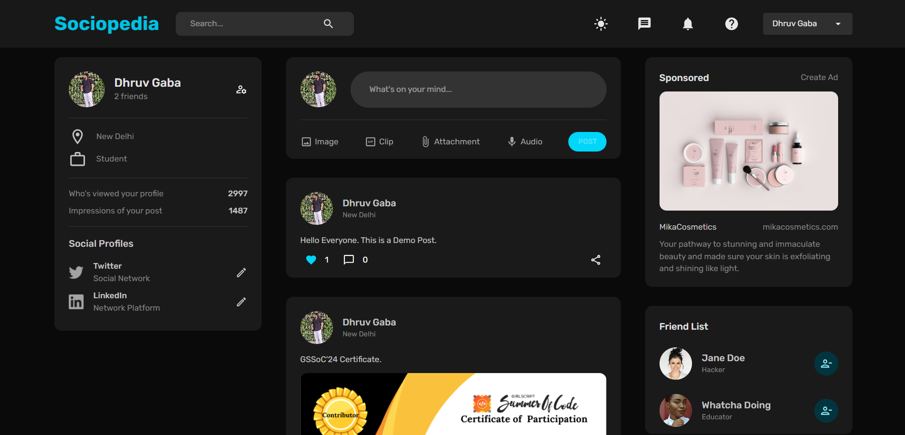

# Sociopedia: Social Media for Sociopaths

**Welcome to Sociopedia, the Social Media for Sociopaths!**

Sociopedia is a comprehensive full-stack social media platform built using the MERN stack (MongoDB, Express, React, Node.js), Redux Toolkit, and Material UI. This project integrates JWT tokens for secure authentication and authorization, providing a robust and user-friendly social media experience.




## Features

- **Post Photos and Memories:** Share your favorite moments with the world.
- **Add and Remove Friends:** Manage your connections with ease.
- **Like and Comment:** Engage with posts through likes and comments.
- **View Profiles:** Explore other users' profiles and connect with them.
- **User Authentication & Authorization:** Secure login and logout using JWT tokens.
- **Responsive Design:** Enjoy a seamless experience across all devices.
- **Real Data Integration:** Interact with real data to enhance authenticity and engagement.
- **Secure Authentication and Authorization:** JWT tokens for secure authentication and authorization.

## Technologies Used

- **Frontend:** React, Material UI, Redux Toolkit
- **Backend:** Node.js, Express
- **Database:** MongoDB
- **Authentication:** JWT Tokens
- **Deployment:** [Click Here](https://sociopedia-socialmedia.onrender.com)

## Getting Started

To get a local copy up and running follow these simple steps.

### Prerequisites

- Node.js and npm installed
- MongoDB running locally or remotely

### Installation

1. Clone the repository:
    ```bash
    git clone https://github.com/Dhruv-Gaba/SOCIOPEDIA-SocialMedia.git
    ```

2. Navigate to the project directory:
    ```bash
    cd SOCIOPEDIA-SocialMedia
    ```

3. Install backend dependencies:
    ```bash
    cd Server
    npm install
    ```

4. Install frontend dependencies:
    ```bash
    cd Client
    npm install
    ```

5. Set up environment variables:
    - Create a `.env` file in the `backend` directory and add your MongoDB URI and JWT secret.

6. Start the backend server:
    ```bash
    cd Server
    npm run dev
    ```

7. Start the frontend development server:
    ```bash
    cd Client
    npm run dev
    ```

## Usage

- Register an account or log in using JWT tokens for secure authentication.
- Explore the platform's features including posting, commenting, liking, and managing friends.

## Contributing

Contributions are welcome! Please fork the repository and submit a pull request with your changes.

## License

This project is licensed under the MIT License - see the [LICENSE](LICENSE) file for details.
